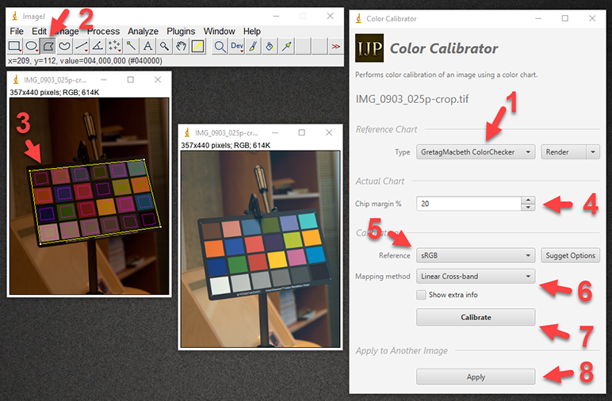
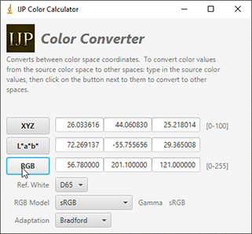

ijp-color
=========

Operations on color spaces and color images. Can be used as a stand-alone library or a plugin for [ImageJ](http://rsb.info.nih.gov/ij)

This is a part of [IJ Plugins Project](http://ij-plugins.sourceforge.net/).

[](https://travis-ci.org/ij-plugins/ijp-color) 
[](https://maven-badges.herokuapp.com/maven-central/net.sf.ij-plugins/ijp-color_2.13) 
[](http://javadoc-badge.appspot.com/net.sf.ij-plugins/ijp-color_2.13)


ImageJ Plugins
--------------

### IJP Color Calibrator

Color calibrates images using a color chart. Supported charts:

* GretagMacbeth ColorChecker
* X-Rite Passport
* Image Science Associates ColorGauge

Supports 8, 16, 32 bit per channel color images, including raw.



Features:
* Interactive placement of color chart (select 4 corners using polygon selection)
* Custom chip margin
* Render colors of the reference chart and display reference values
* Assume that input image is in linear XYZ (e.g raw image) or non-linear (sRGB) color space
* 6 mapping options (linear, linear cross-band, quadratic, quadratic cross-band, cubic, cubic-cross band)
* Automatic computation of the best reference and mapping method ("Suggest Options")
* Displays detailed information about the correction, including errors for each chip, and correction fit scatter plots ("Show extra info")

### IJP Color Calculator

Tool for converting individual color values between different color spaces. Inspired by Bruce Lindbloom [CIE Color Calculator](http://www.brucelindbloom.com/index.html?ColorCalculator.html)




Test Images
-----------

You can test the calibrator plugin using images in [test/data](test/data).


Stand-alone Library
-------------------

`ijp-color` was designed to be easily used as a stand-alone library. 
Examples of use are provided in the [ijp-color/test](ijp-color/src/main/test/scala/net/ij/ij_plugins/color) directory.


Development Setup
-----------------

The minimum requirement to build an run the plugin in development environment is [Java](java.oracle.com) and [SBT](http://www.scala-sbt.org/). 
SBT will download all needed dependencies. Key libraries: 
[ImageJ](https://imagej.nih.gov/ij/), [Scala](https://www.scala-lang.org/), and [ScalaFX](http://www.scalafx.org/).

### Command line

You can build the `ij-color` plugins and run it within ImageJ using SBT task `ijRun` from the `experimental` module:
 
```
sbt experimental/ijRun
```


### IntelliJ

You will need to install Scala plugin then import the project from `build.sbt` file. To run the `ij-color` plugins in ImageJ, setup "Run Configuration" for "SBT Task" and add task `experimental/ijRun`.  
